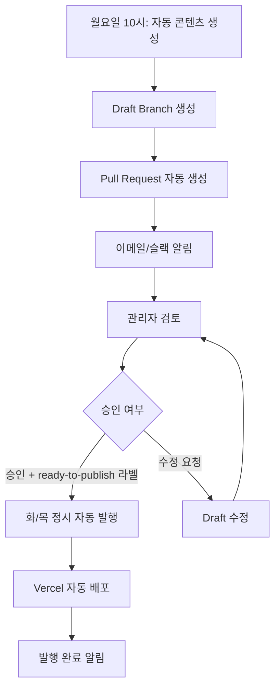

# 📝 FamilyOffice S 블로그 자동화 시스템

승인 기반 블로그 콘텐츠 자동 생성 및 발행 시스템입니다.

## 🔄 워크플로우 개요



## 📅 자동 스케줄

### 콘텐츠 생성

- **매주 월요일 오전 10:00**: 다음 주 콘텐츠 자동 생성
- **수동 실행**: GitHub Actions에서 언제든 실행 가능

### 자동 발행

- **화요일 오후 2:30**: 실무 가이드 자동 발행
- **목요일 저녁 8:00**: 사례 연구/분석 자동 발행

## 🛠️ 시스템 구성

### 1. GitHub Actions 워크플로우

#### 📝 콘텐츠 생성 (`blog-content-generation.yml`)

```yaml
트리거:
  - 스케줄: 매주 월요일 10시 (cron: '0 1 * * 1')
  - 수동: workflow_dispatch

기능:
  - 다음 주 콘텐츠 계획 수립
  - 화요일/목요일 콘텐츠 자동 생성
  - Draft Branch 생성 및 PR 생성
  - 검토 알림 발송
```

#### 🚀 자동 발행 (`blog-auto-publish.yml`)

```yaml
트리거:
  - 스케줄: 화요일 14:30, 목요일 20:00
  - 수동: workflow_dispatch

기능:
  - 승인된 콘텐츠 확인
  - 자동 병합 및 발행
  - 블로그 데이터 업데이트
  - Vercel 배포 트리거
```

### 2. 스크립트 시스템

#### `scripts/convert-draft-to-blog.js`

- Draft 마크다운을 블로그 포스트 객체로 변환
- Frontmatter 파싱 및 메타데이터 처리

#### `scripts/update-blog-data.js`

- 블로그 데이터 최적화 및 정렬
- 카테고리별 포스트 수 자동 계산
- 데이터 유효성 검사

### 3. 디렉토리 구조

```
FamilyOffice/
├── .github/workflows/
│   ├── blog-content-generation.yml    # 콘텐츠 생성
│   └── blog-auto-publish.yml          # 자동 발행
├── scripts/
│   ├── convert-draft-to-blog.js       # Draft 변환
│   └── update-blog-data.js            # 데이터 업데이트
├── lib/
│   ├── blog-data.ts                   # 메인 블로그 데이터
│   ├── blog-drafts/                   # 임시 Draft 저장
│   └── blog-archive/                  # 발행된 Draft 아카이브
└── README-blog-automation.md          # 이 문서
```

## 🎯 사용 방법

### 자동 생성된 콘텐츠 검토

1. **알림 확인**: 매주 월요일 10시 이후 슬랙/이메일 알림
2. **PR 검토**: GitHub에서 생성된 PR 확인
3. **콘텐츠 검수**: Draft 파일들의 품질 및 정확성 검토
4. **승인 처리**:
   - ✅ 승인: `ready-to-publish` 라벨 추가
   - 🔄 수정: 코멘트로 수정 요청 또는 직접 편집

### 수동 실행

#### 콘텐츠 생성

```bash
# GitHub Actions에서 수동 실행
Actions > 블로그 콘텐츠 자동 생성 및 검토 > Run workflow
```

#### 즉시 발행

```bash
# GitHub Actions에서 수동 실행
Actions > 블로그 콘텐츠 자동 발행 > Run workflow
```

## 🔧 설정 및 환경변수

### GitHub Secrets 필요

```bash
GITHUB_TOKEN          # 기본 제공
SLACK_WEBHOOK_URL      # 슬랙 알림용 (선택사항)
```

### 환경 설정

- **Node.js**: 18+
- **Dependencies**: badge-maker, @octokit/rest
- **권한**: Repository write 권한 필요

## 📊 콘텐츠 템플릿

### 화요일 - 실무 가이드

```yaml
구조:
  - 도입부 (300단어): 문제 제기 + 중요성
  - 핵심 가이드 (2,000-2,500단어): 단계별 실행 방법
  - 실전 팁 (500단어): 즉시 실행 가능한 조언
  - 사례 요약 (300단어): Before/After 결과
  - CTA: 전문가 상담 + 뉴스레터 구독

키워드 타겟:
  - How-to 키워드
  - 실무, 가이드, 방법, 전략
```

### 목요일 - 사례 연구/분석

```yaml
구조:
  - Executive Summary (200단어): 핵심 성과 3가지
  - 배경 상황 (500단어): 클라이언트 프로필 + 도전과제
  - 상세 분석 (1,500-2,000단어): 단계별 실행 과정
  - 측정 가능한 성과 (500단어): 정량/정성적 결과
  - 핵심 교훈 (500단어): 일반화 가능한 시사점
  - CTA: 맞춤 컨설팅

키워드 타겟:
  - 사례, 성공기, 전략, 분석
  - Before/After, ROI, 성과
```

## 🚨 문제 해결

### 일반적인 문제들

#### 1. PR 생성 실패

```bash
원인: GitHub Token 권한 부족
해결: Repository Settings > Actions > General > Workflow permissions 확인
```

#### 2. 자동 발행 건너뜀

```bash
원인: ready-to-publish 라벨 누락
해결: PR에 라벨 수동 추가 후 다음 스케줄 대기
```

#### 3. Draft 변환 오류

```bash
원인: Frontmatter 형식 불일치
해결: scripts/convert-draft-to-blog.js 실행하여 오류 확인
```

### 수동 복구 방법

#### Draft를 직접 블로그 데이터로 추가

```bash
cd /Users/jaehong/Developer/Projects/FamilyOffice
node scripts/convert-draft-to-blog.js lib/blog-drafts/tuesday-2025-02-04.md
node scripts/update-blog-data.js
```

#### 블로그 데이터 최적화

```bash
node scripts/update-blog-data.js
```

## 📈 모니터링 및 성과

### 자동 추적 지표

- 생성된 콘텐츠 수
- 발행 성공률
- 평균 검토 시간
- 사용자 참여도

### 알림 채널

- **슬랙**: 실시간 워크플로우 상태
- **이메일**: 중요한 승인 요청
- **GitHub**: PR 코멘트 및 라벨

## 🔄 업데이트 및 유지보수

### 콘텐츠 템플릿 수정

1. `content-templates.md` 업데이트
2. `blog-content-generation.yml` 템플릿 섹션 수정
3. 테스트 실행으로 확인

### 스케줄 변경

1. `.github/workflows/` 파일의 cron 표현식 수정
2. `content-calendar-2025.md` 일정 업데이트

### 알림 설정 변경

1. GitHub Secrets에 새로운 웹훅 URL 추가
2. 워크플로우 파일의 알림 섹션 수정

---

## 🎯 다음 단계

1. **슬랙 연동**: `SLACK_WEBHOOK_URL` 설정
2. **테스트 실행**: 수동으로 워크플로우 테스트
3. **모니터링**: 첫 주 자동 실행 모니터링
4. **최적화**: 사용자 피드백 기반 개선

> 💡 **팁**: 처음 1-2주는 수동으로 워크플로우를 실행해보면서 시스템이 정상 작동하는지 확인하는 것을 추천합니다.
