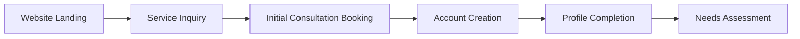
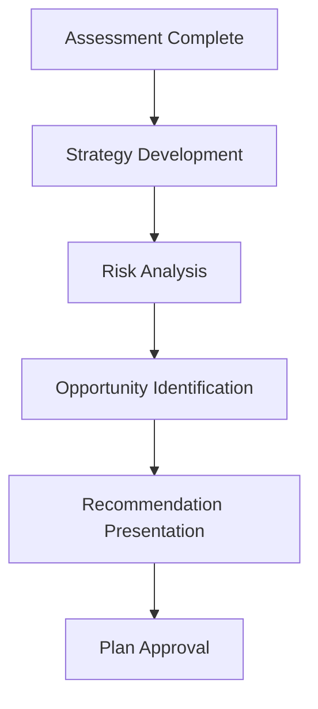
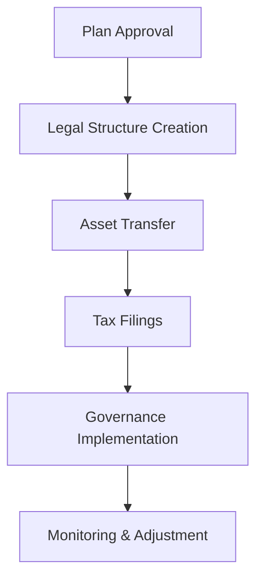
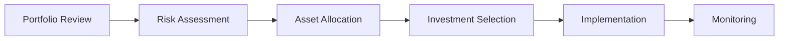
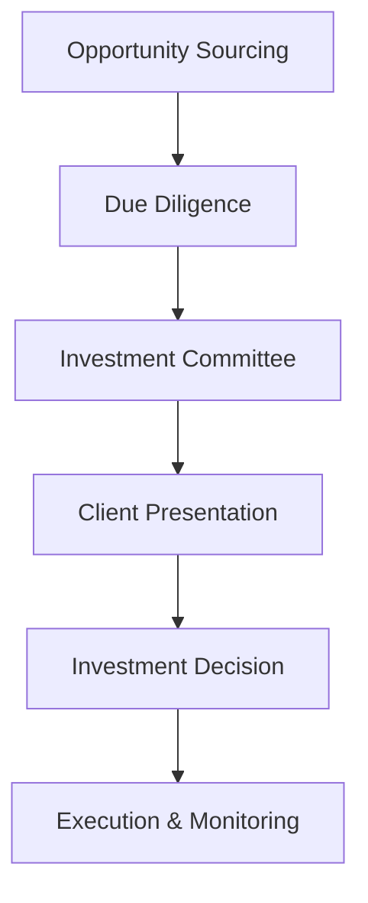
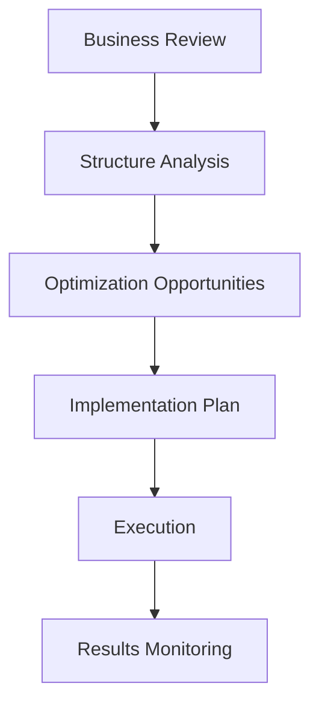
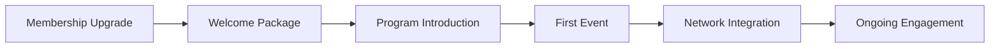
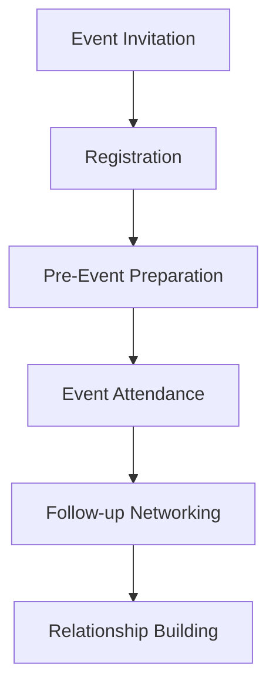
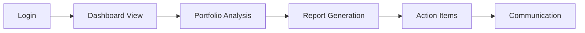
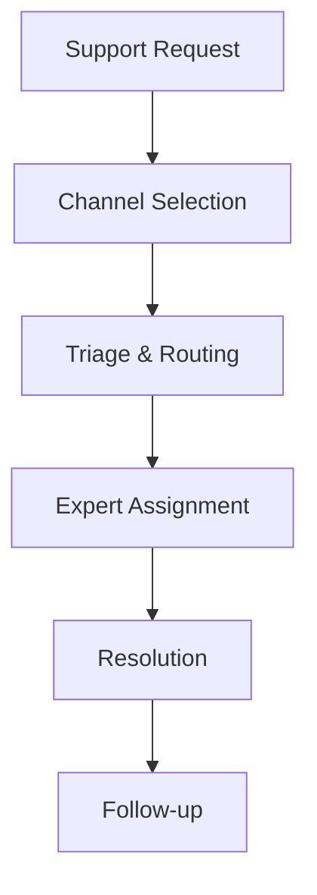

# FamilyOffice S - User Workflows

## Overview

This document outlines the key user workflows for FamilyOffice S, designed specifically for Korean mid-market company CEOs and high-net-worth individuals seeking comprehensive wealth management and business succession planning services.

## Primary User Personas

### 1. Established CEO (기존 경영자)

- **Profile**: 50-65 years old, 1st generation entrepreneur
- **Company**: ₩500억-₩2,000억 annual revenue
- **Goals**: Business succession planning, tax optimization, wealth preservation
- **Pain Points**: Complex Korean tax laws, succession timing, family dynamics

### 2. Next-Generation Leader (차세대 경영자)

- **Profile**: 30-45 years old, 2nd/3rd generation family business successor
- **Company**: Inherited or co-managing family business
- **Goals**: Modernization, growth strategies, leadership development
- **Pain Points**: Balancing tradition with innovation, proving capability, managing family expectations

### 3. Tech Entrepreneur (테크 기업가)

- **Profile**: 35-50 years old, founded tech company
- **Company**: ₩100억-₩1,000억 valuation
- **Goals**: Exit strategies, investment opportunities, scaling operations
- **Pain Points**: Regulatory compliance, international expansion, talent retention

### 4. Serial Investor (연쇄 투자자)

- **Profile**: 45-60 years old, multiple business interests
- **Assets**: ₩100억+ liquid assets, diverse portfolio
- **Goals**: Portfolio optimization, new opportunities, risk management
- **Pain Points**: Due diligence, market timing, regulatory changes

## Core User Workflows

### Workflow 1: Initial Onboarding & Assessment

#### 1.1 Discovery & Registration



**Step-by-Step Process:**

1. **Website Discovery**
   - User lands on familyoffices.vip
   - Browses services by industry or need
   - Views case studies and testimonials
   - Action: Clicks "상담 신청" (Request Consultation)

2. **Initial Contact Form**

   ```typescript
   interface InitialInquiry {
     name: string;
     company: string;
     industry:
       | 'manufacturing'
       | 'construction'
       | 'it_venture'
       | 'finance'
       | 'other';
     companySize: '1-50' | '51-200' | '201-1000' | '1000+';
     revenue: string;
     inquiryType:
       | 'succession_planning'
       | 'tax_optimization'
       | 'investment'
       | 'general';
     preferredContactMethod: 'phone' | 'email' | 'in_person';
     urgency:
       | 'immediate'
       | 'within_month'
       | 'within_quarter'
       | 'planning_ahead';
   }
   ```

3. **Consultation Booking**
   - Cal.com integration displays available slots
   - Korean business hours consideration (9 AM - 6 PM KST)
   - Consultant assignment based on expertise match
   - Automated confirmation with preparation materials

4. **Account Setup**
   - Clerk authentication with Korean phone verification
   - Supabase profile creation and sync
   - Membership tier determination (Basic → Premium → VIP)
   - Welcome email with onboarding checklist

5. **Comprehensive Assessment**
   ```typescript
   interface WealthAssessment {
     personalFinances: {
       liquidAssets: number;
       realEstate: Property[];
       investments: Investment[];
       liabilities: Liability[];
     };
     businessAssets: {
       companyValuation: number;
       ownershipPercentage: number;
       businessType: string;
       employees: number;
       annualRevenue: number;
     };
     goals: {
       successionTimeline: string;
       riskTolerance: 'conservative' | 'moderate' | 'aggressive';
       priorityAreas: string[];
     };
     familyStructure: {
       spouse: boolean;
       children: number;
       dependents: number;
       successors: SuccessorInfo[];
     };
   }
   ```

**Expected Duration:** 2-3 weeks
**Key Touchpoints:** Initial call, in-person meeting, document review
**Success Metrics:** Complete profile, identified priority areas, action plan created

#### 1.2 Strategic Planning Session



**Planning Session Agenda:**

1. **Current State Analysis** (30 minutes)
   - Asset portfolio review
   - Tax situation assessment
   - Business performance analysis
   - Risk exposure evaluation

2. **Goal Alignment** (45 minutes)
   - Family objectives discussion
   - Business continuity planning
   - Wealth preservation priorities
   - Timeline establishment

3. **Strategy Presentation** (60 minutes)
   - Customized recommendations
   - Tax optimization scenarios
   - Implementation timeline
   - Investment proposals

4. **Next Steps** (15 minutes)
   - Service agreement finalization
   - Team assignment
   - Communication protocols
   - First milestone scheduling

### Workflow 2: Business Succession Planning (가업승계)

#### 2.1 Succession Assessment & Design


**Detailed Process:**

1. **Business Valuation**

   ```typescript
   interface BusinessValuation {
     valuationMethod: 'dcf' | 'market_multiple' | 'asset_based' | 'hybrid';
     enterpriseValue: number;
     equityValue: number;
     valuationDate: Date;
     discountFactors: {
       marketabilityDiscount: number;
       minorityDiscount: number;
       keyPersonDiscount: number;
     };
     growthAssumptions: {
       revenueGrowth: number[];
       marginImprovement: number[];
       capitalRequirements: number[];
     };
   }
   ```

2. **Family Readiness Assessment**
   - Next-generation capability evaluation
   - Interest and commitment assessment
   - Leadership development needs
   - Family governance structure

3. **Tax Optimization Modeling**

   ```typescript
   interface TaxScenario {
     scenarioName: string;
     transferMethod: 'gift' | 'sale' | 'hybrid';
     timing: 'immediate' | 'gradual' | 'deferred';
     taxLiability: {
       giftTax: number;
       inheritanceTax: number;
       capitalGainsTax: number;
       total: number;
     };
     benefits: {
       familyBusinessTaxRelief: number;
       deferralBenefits: number;
       exemptions: number;
     };
     netCost: number;
   }
   ```

4. **Structure Recommendation**
   - Family holding company design
   - Voting vs. non-voting shares
   - Management structure
   - Governance protocols

**Timeline:** 8-12 weeks
**Key Deliverables:**

- Comprehensive valuation report
- Tax optimization analysis
- Implementation roadmap
- Legal structure recommendations

#### 2.2 Implementation & Execution



**Implementation Phases:**

1. **Legal Foundation** (Weeks 1-4)
   - Family holding company incorporation
   - Corporate governance documents
   - Shareholder agreements
   - Employment contracts for successors

2. **Asset Transfer** (Weeks 5-8)
   - Share transfer execution
   - Valuation finalizations
   - Tax filings and payments
   - Regulatory notifications

3. **Operational Transition** (Weeks 9-12)
   - Management role transitions
   - Board composition changes
   - Decision-making protocol implementation
   - Performance monitoring setup

4. **Ongoing Management** (Ongoing)
   - Quarterly governance reviews
   - Annual tax planning
   - Performance assessments
   - Strategy adjustments

### Workflow 3: Investment Management & Portfolio Optimization

#### 3.1 Portfolio Analysis & Strategy



**Portfolio Management Process:**

1. **Current Holdings Analysis**

   ```typescript
   interface PortfolioAnalysis {
     totalValue: number;
     assetAllocation: {
       korean_stocks: number;
       global_stocks: number;
       bonds: number;
       real_estate: number;
       alternatives: number;
       cash: number;
     };
     riskMetrics: {
       volatility: number;
       sharpeRatio: number;
       maxDrawdown: number;
       correlation: number;
     };
     performance: {
       oneYear: number;
       threeYear: number;
       fiveYear: number;
       sinceInception: number;
     };
   }
   ```

2. **Risk Tolerance Assessment**
   - Quantitative risk questionnaire
   - Behavioral finance evaluation
   - Scenario stress testing
   - Liquidity requirements analysis

3. **Strategic Asset Allocation**
   - Korean vs. global exposure
   - Growth vs. value orientation
   - Alternative investments integration
   - ESG considerations

4. **Investment Implementation**
   - Manager selection process
   - Due diligence procedures
   - Fee negotiation
   - Performance benchmarking

**Key Features:**

- Real-time Korean market data integration
- Automated rebalancing alerts
- Tax-efficient rebalancing
- Performance attribution analysis

#### 3.2 Alternative Investment Opportunities



**Alternative Investment Process:**

1. **Deal Sourcing**
   - Private equity opportunities
   - Real estate investments
   - Hedge fund allocations
   - Direct business investments

2. **Due Diligence Framework**

   ```typescript
   interface DueDiligenceReport {
     investment: {
       type: 'private_equity' | 'real_estate' | 'hedge_fund' | 'direct';
       minimumInvestment: number;
       lockupPeriod: number;
       expectedReturn: number;
       riskRating: 'low' | 'medium' | 'high';
     };
     manager: {
       trackRecord: number[];
       experience: number;
       aum: number;
       teamStability: string;
     };
     riskFactors: string[];
     recommendation: 'approved' | 'declined' | 'conditional';
   }
   ```

3. **Client Matching**
   - Risk profile alignment
   - Liquidity requirement matching
   - Minimum investment capacity
   - Strategic fit assessment

### Workflow 4: Tax Planning & Optimization

#### 4.1 Annual Tax Strategy Review


**Tax Planning Workflow:**

1. **Regulatory Monitoring**
   - Korean tax law updates tracking
   - International tax changes
   - Industry-specific regulations
   - Compliance requirement changes

2. **Tax Position Analysis**

   ```typescript
   interface TaxAnalysis {
     currentYear: {
       corporateTax: number;
       personalIncomeTax: number;
       inheritanceTax: number;
       giftTax: number;
       other: number;
     };
     projectedLiability: {
       baseCase: number;
       optimizedCase: number;
       potentialSavings: number;
     };
     strategies: TaxStrategy[];
     risks: RiskFactor[];
   }
   ```

3. **Optimization Strategies**
   - Income deferral techniques
   - Expense acceleration
   - Investment structure optimization
   - Succession planning integration

4. **Implementation & Compliance**
   - Strategy execution
   - Documentation requirements
   - Filing deadlines management
   - Audit defense preparation

#### 4.2 Business Structure Optimization



**Structure Optimization Process:**

1. **Current Structure Assessment**
   - Legal entity analysis
   - Ownership structure review
   - Operational efficiency evaluation
   - Tax effectiveness assessment

2. **Optimization Opportunities**
   - Entity restructuring
   - Holding company benefits
   - Transfer pricing optimization
   - International structure considerations

3. **Implementation Planning**
   - Legal requirements mapping
   - Timeline development
   - Cost-benefit analysis
   - Risk mitigation strategies

### Workflow 5: Member Engagement & Networking

#### 5.1 Premium Member Onboarding



**Member Onboarding Process:**

1. **Welcome & Orientation**

   ```typescript
   interface MemberWelcomePackage {
     membershipTier: 'premium' | 'vip';
     benefits: {
       monthlyBreakfasts: boolean;
       quarterlyWorkshops: boolean;
       exclusiveEvents: boolean;
       prioritySupport: boolean;
       customReports: boolean;
     };
     networking: {
       memberDirectory: boolean;
       industryGroups: string[];
       mentorshipProgram: boolean;
     };
     events: {
       upcomingEvents: Event[];
       registrationLinks: string[];
     };
   }
   ```

2. **Industry Group Assignment**
   - Manufacturing sector group
   - Construction industry circle
   - IT/Venture community
   - Finance sector network

3. **Mentor Matching**
   - Senior member pairing
   - Industry expertise matching
   - Success story sharing
   - Guidance and support

#### 5.2 Event Participation & Networking



**Event Workflow:**

1. **Monthly CEO Breakfast**
   - Industry trend discussions
   - Regulatory update presentations
   - Networking sessions
   - Expert speaker series

2. **Quarterly Strategic Workshops**
   - Deep-dive industry analysis
   - Best practice sharing
   - Collaborative problem-solving
   - Action planning sessions

3. **Annual VIP Retreats**
   - Strategic planning intensive
   - International expert presentations
   - Cultural and recreational activities
   - Long-term relationship building

### Workflow 6: Digital Platform Usage

#### 6.1 Dashboard & Analytics Access



**Digital Experience Flow:**

1. **Authentication & Access**
   - Clerk-based secure login
   - Multi-factor authentication
   - Role-based dashboard customization
   - Mobile-responsive interface

2. **Real-Time Data Integration**

   ```typescript
   interface DashboardData {
     portfolio: {
       totalValue: number;
       dailyChange: number;
       performanceMetrics: PerformanceData;
       assetAllocation: AllocationData;
     };
     market: {
       koreanIndices: MarketData[];
       globalMarkets: MarketData[];
       currencyRates: ForexData[];
     };
     alerts: {
       portfolioAlerts: Alert[];
       marketAlerts: Alert[];
       systemNotifications: Notification[];
     };
   }
   ```

3. **Interactive Features**
   - Custom report generation
   - Scenario modeling tools
   - Appointment scheduling
   - Document library access

#### 6.2 Communication & Support



**Support Workflow:**

1. **Multi-Channel Support**
   - ChannelTalk for immediate queries
   - Email for detailed inquiries
   - Phone for urgent matters
   - In-person for complex discussions

2. **Expert Routing**
   - Query categorization
   - Expertise matching
   - Priority assignment
   - Response time targets

3. **Resolution Tracking**
   - Case management system
   - Status updates
   - Satisfaction surveys
   - Knowledge base updates

## Success Metrics & KPIs

### User Engagement Metrics

```typescript
interface UserEngagementKPIs {
  onboarding: {
    completionRate: number; // Target: >95%
    timeToFirstValue: number; // Target: <7 days
    dropOffPoints: string[];
  };
  platform: {
    monthlyActiveUsers: number;
    sessionDuration: number; // Target: >10 minutes
    featureAdoption: number; // Target: >80%
  };
  satisfaction: {
    nps: number; // Target: >70
    retentionRate: number; // Target: >95%
    referralRate: number; // Target: >25%
  };
}
```

### Business Outcome Metrics

```typescript
interface BusinessOutcomeKPIs {
  financial: {
    aum: number; // Assets Under Management
    revenuePerClient: number;
    profitMargin: number;
  };
  operational: {
    clientAcquisitionCost: number;
    serviceDeliveryTime: number;
    consultantUtilization: number;
  };
  strategic: {
    marketShare: number;
    serviceExpansion: number;
    partnershipGrowth: number;
  };
}
```

These comprehensive user workflows ensure that FamilyOffice S delivers exceptional value to Korean business leaders while maintaining operational efficiency and scalable growth.
