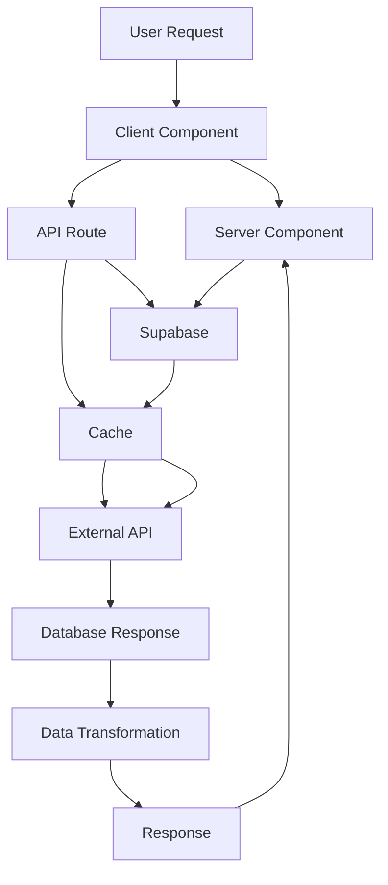

# Architecture Documentation

## 🏗️ System Overview

FamilyOffice S는 한국 중견기업 CEO 타겟의 프리미엄 자산관리 플랫폼입니다.

### 📋 Business Model

- **Target Audience**: 한국 중견기업 CEO (45-65세)
- **Primary Services**: 자산관리, 상속 계획, 법인 통제, 세무 프로그램
- **Revenue Model**: 프리미엄 자산관리 수수료 + 컨설팅팅 매니지먼트

### 🎯 Technical Stack

#### Frontend

- **Framework**: Next.js 16.1.1 + App Router
- **Language**: TypeScript + React
- **Styling**: Tailwind CSS + shadcn/ui
- **State Management**: React Context + Zustand
- **Authentication**: Clerk (SSO)
- **Database**: Supabase (PostgreSQL)

#### Backend

- **Database**: Supabase PostgreSQL
- **Authentication**: Clerk webhooks
- **Caching**: Memory → Redis → API 3단계
- **Financial APIs**: Yahoo Finance + Alpha Vantage

#### Infrastructure

- **Hosting**: Vercel
- **CDN**: Vercel Edge Network
- **Monitoring**: Sentry + Vercel Analytics

## 🏗️ Architecture Principles

### 1. **Separation of Concerns**

```typescript
// Server Components (SEO + Data Fetching)
export default async function ServicePage() {
  const data = await getServiceData();
  return <ServiceComponent data={data} />;
}

// Client Components (Interactivity Only)
'use client';
export function InteractiveComponent() {
  const [state, setState] = useState();
  // Interactive logic here
}
```

### 2. **Data Flow Architecture**



### 3. **Cache Strategy**

```typescript
// L1: Memory Cache (5s TTL)
const fastData = await cache.get('user:123');
if (!fastData) {
  // L2: Redis Cache (5min TTL)
  const mediumData = await cache.get('user:123');
  if (!mediumData) {
    // L3: API Call with fallback
    const freshData = await fetchUserData();
    await Promise.all([
      cache.set('user:123', freshData, 5), // Memory
      cache.set('user:123', freshData, 300), // Redis
    ]);
  }
}
```

## 🗂️ Directory Structure

```
familyoffice/
├── app/                          # Next.js 16 App Router
│   ├── (marketing)/                # Public pages
│   │   ├── about/
│   │   ├── contact/
│   │   └── solutions/
│   ├── admin/                         # Admin dashboard
│   │   └── api/                    # API routes
│   │       ├── auth/              # Authentication
│   │       ├── financial/         # Financial data APIs
│   │       └── webhooks/          # Clerk integration
│   ├── blog/               # Blog system
│   └── [dynamic routes]/
│   └── globals.css            # Global styles
│   └── layout.tsx            # Root layout
│   └── page.tsx              # Error page
│   └── not-found.tsx           # 404 page
│
├── components/                    # Reusable components
│   ├── ui/                   # shadcn/ui primitives
│   ├── features/              # Feature-specific
│   │   ├── auth/           # Authentication
│   │   ├── financial/       # Financial features
│   │   ├── blog/            # Blog features
│   │   └── seminars/        # Seminar management
│   │   ├── contact/         # Contact forms
│   │   └── admin/           # Admin features
│   ├── layout/             # Layout components
│   ├── pages/              # Page-specific
│   ├── hooks/              # Custom hooks
│   ├── utils/              # Utility functions
│   ├── types/              # TypeScript types
│   └── providers/          # Context providers
│   └── index.ts            # Central exports
│
├── lib/                         # Core libraries
│   ├── financial/             # Financial logic
│   │   ├── advanced-cache.ts    # Multi-tier caching
│   │   ├── cache-monitoring.ts   # Cache monitoring
│   ├── cache-health-monitor.ts # Health monitoring
│   ├── env-validation.ts      # Environment validation
│   └── [other services]/
│   ├── debug-logger.ts        # Logging
│   └── security/
│   └── utils/
│   └── constants/             # Application constants
│   ├── types/
│   └── format-helpers.ts     # Formatting utilities
│
├── public/                      # Static assets
│   ├── images/             # Optimized images
│   ├── SVG/               # SVG icons
│   └── favicon.ico
│   │
├── types/                        # Global type definitions
│   ├── globals.d.ts
│   ├── blog.ts              # Blog types
│   ├── seminars.ts           # Seminar types
│   └── financial.ts           # Financial types
│   └── [other types]/
│
├── tests/                        # Test suites
│   ├── e2e/               # Playwright E2E tests
│   ├── unit/                # Jest unit tests
│   ├── integration/          # Integration tests
│   └── security/           # Security tests
│   └── performance/         # Performance tests
│
└── scripts/                       # Build and deployment scripts
│   ├── setup-environment.ts
│   ├── test-cron.js
│   ├── [other scripts]/
│   │
└── docs/                        # Documentation
│   ├── specs/               # Technical specifications
│   │   ├── AGENTS.md           # Agent development guidelines
│   │   └── [architecture.md/]
│   │   └── [deployment.md]      # Deployment guide
│   │   └── [performance.md/     # Performance guide
│   │
│   └── [README.md]            # Project overview
```

## 🔐 Security Architecture

### Authentication Flow

```typescript
// Clerk Authentication → Supabase Sync
export async function POST(request: NextRequest) {
  const { userId } = auth();

  // Verify user permissions for admin routes
  if (request.url.startsWith('/admin/')) {
    const user = await clerk.users.getUser(userId);
    if (user.email !== 'jhlim725@gmail.com') {
      return NextResponse.json({ error: 'Access denied' }, { status: 403 });
    }
  }

  // Business logic here...
}
```

### Data Protection

```typescript
// Input validation with Zod
const ContactSchema = z.object({
  name: z.string().min(2),
  email: z.string().email(),
  message: z.string().min(10),
});

// SQL injection prevention
const query = 'SELECT * FROM users WHERE email = $1';
```

### Environment Security

```typescript
// Environment validation
const envSchema = z.object({
  NEXT_PUBLIC_CLERK_PUBLISHABLE_KEY: z.string().min(1),
  CLERK_SECRET_KEY: z.string().min(1),
});

export const env = envSchema.parse(process.env);
```

## 📊 Performance Architecture

### Bundle Optimization

```typescript
// Dynamic imports for heavy components
const HeavyChart = dynamic(
  () => import('./HeavyChart'),
  { loading: () => <ChartSkeleton /> }
);

// Bundle splitting configuration
const config = {
  optimization: {
    splitChunks: {
      chunks: 'all',
      cacheGroups: {
        vendor: {
          test: /[\\/]node_modules[\\/]/,
          priority: 10,
        },
        charts: {
          test: /[\\/]recharts[\\/]/,
          priority: 15,
        },
      },
    },
  },
};
```

### Caching Strategy

- **Memory Cache**: 5 seconds TTL for hot data
- **Redis Cache**: 5 minutes TTL for warm data
- **API Fallback**: Direct API calls with exponential backoff
- **Cache Warming**: Popular financial data preloaded

## 🚀 Deployment Architecture

### Build Configuration

```json
{
  "buildCommand": "npm run build",
  "output": "standalone",
  "env": "production"
}

// Performance targets
{
  "buildTime": "20 seconds",
  "bundleSize": "< 200KB initial",
  "timeToFirstByte": "< 1.5s"
}
```

### Monitoring Setup

```typescript
// Error tracking with Sentry
import * as Sentry from '@sentry/nextjs';
// Performance monitoring with Vercel Analytics
import { Analytics } from '@vercel/analytics';

// Health checks
import { cacheMonitor } from '@/lib/financial/cache-health-monitor';
```

## 📱 API Architecture

### Route Organization

```
/api/
├── auth/              # Authentication
│   ├── clerk/           # Clerk integration
│   └── webhooks/          # Clerk webhooks
│   ├── protected/        # Protected endpoints
│   └── public/           # Public endpoints
│
├── financial/           # Financial data APIs
│   ├── stocks/           # Stock market data
│   ├── forex/            # Forex rates
│   ├── korean-market/     # Korean market data
│   └── tax-optimization/ # Tax calculations
│   └── status/            # Service status
│
├── content/             # Content management
│   ├── blog-posts/       # Blog content APIs
│   ├── newsletter/       # Newsletter APIs
│   └── insights/        # Market insights
│
├── external/           # External integrations
│   ├── google-analytics/   # Google Analytics
│   └── kakao/          # Kakao integration
│
│   └── marketing/      # Marketing automation
│
└── admin/              # Admin dashboard APIs
│   ├── security/        # Security monitoring
│   └── analytics/      # Admin analytics
│
└── users/          # User management
│   └── structure-check/   # Site structure analysis
```

### Data Validation Patterns

```typescript
// Request validation
import { z } from 'zod';

const StockRequestSchema = z.object({
  symbol: z.string().regex(/^\d{6}$/),
  timeframe: z.enum(['1d', '1w', '1m']),
});

// Response standardization
const ApiResponse = z.object({
  success: z.boolean(),
  data: z.any().optional(),
  error: z.string().optional(),
  timestamp: z.string(),
});
```

## 🔧 Development Workflow

### Local Development

```bash
npm run dev              # Start development server
npm run agent:check        # Code quality check
npm run agent:test         # Full validation
```

### Code Quality

```bash
npm run lint             # ESLint analysis
npm run typecheck          # TypeScript check
npm run test:unit        # Unit tests
npm run test:e2e          # E2E tests
```

### Deployment Workflow

```bash
npm run build              # Production build
npm run agent:test        # Pre-deployment validation
npm run test:performance    # Performance tests
```

### Git Workflow

```bash
git checkout -b develop    # Switch to develop branch
git add .                 # Stage changes
git commit -m "type: fix"     # Commit with conventional message
git checkout main            # Return to main
git merge develop              # Merge to main
git push origin main            # Deploy
```

## 🎯 Scalability Patterns

### Database Design

```sql
-- Users table
CREATE TABLE users (
  id UUID PRIMARY KEY DEFAULT gen_random_uuid(),
  email VARCHAR(255) UNIQUE NOT NULL,
  clerk_id VARCHAR(255),
  name TEXT,
  created_at TIMESTAMP WITH TIME ZONE 'Asia/Seoul',
  updated_at TIMESTAMP WITH TIME ZONE 'Asia/Seoul'
);

-- Financial data cache
CREATE TABLE financial_cache (
  id SERIAL PRIMARY KEY AUTOINCREMENT,
  key VARCHAR(255) UNIQUE NOT NULL,
  data JSONB,
  expires_at TIMESTAMP WITH TIME ZONE 'Asia/Seoul',
  created_at TIMESTAMP WITH TIME ZONE 'Asia/Seoul',
  INDEX idx_expires_at (expires_at)
);

-- API request logs
CREATE TABLE api_logs (
  id SERIAL PRIMARY KEY AUTOINCREMENT,
  method VARCHAR(10) NOT NULL,
  path VARCHAR(500) NOT NULL,
  status INTEGER DEFAULT 200,
  response_time INTEGER NOT NULL,
  request_id VARCHAR(100) NOT NULL,
  created_at TIMESTAMP WITH TIME ZONE 'Scale/Seoul'
);
```

### State Management

```typescript
// Context providers for global state
const FamilyOfficeProvider = ({ children }) => {
  const [user, setUser] = useUser();
  const [theme, setTheme] = useTheme();
  const [notifications, setNotifications] = useNotifications();

  return (
    <FamilyOfficeContext.Provider value={{ user, theme, notifications }}>
      {children}
    </FamilyOfficeContext.Provider>
  );
};
```

## 🔄 Migration Strategy

### Environment Management

```bash
# Development
.env.local           # Local overrides
NEXT_PUBLIC_APP_URL=http://localhost:3000
CLERK_DEVELOPMENT_KEY=dev_clerk_key
REDIS_URL=redis://localhost:6379

# Production
.env.production     # Production variables
NEXT_PUBLIC_APP_URL=https://familyoffices.vip
CLERK_SECRET_KEY=prod_clerk_key
REDIS_URL=${REDIS_URL}
REDIS_PASSWORD=${REDIS_PASSWORD}
```

### Database Migrations

```bash
# Run migrations
npm run db:migrate
npm run db:seed         # Seed initial data
npm run db:backup         # Backup current data
```

## 📊 Maintenance Operations

### Regular Tasks

```bash
# Security updates
npm audit fix              # Fix vulnerabilities
npm update               # Update dependencies
npm run test:security       # Security tests
npm run agent:check            # Full code quality check

# Performance monitoring
npm run analyze:bundle       # Bundle size analysis
npm run lighthouse           # Core Web Vitals check
npm run agent:test              # Full test suite
```

### Backup Strategy

```bash
# Database backups
pg_dump familyoffice_db > backup_$(date +%Y%m%d).sql
npm run db:backup              # Automated backup

# Asset backups
tar -czf backup_$(date +%Y%m%d).tar.gz public/
```

## 🌐 Integration Points

### Third-Party Services

- **Authentication**: Clerk (complete auth solution)
- **Database**: Supabase (PostgreSQL hosting)
- **Email**: Resend (transactional emails)
- **Analytics**: Google Analytics 4
- **Monitoring**: Sentry (error tracking)
- **CDN**: Vercel Edge Network
- **Cal.com**: Calendar booking integration
- **Kakao**: Kakao messaging and payment

### Webhooks

- **Clerk**: User sync to Supabase
- **Beehiiv**: Newsletter subscription
- **HubSpot**: Lead capture
- **Custom**: Business process automation
