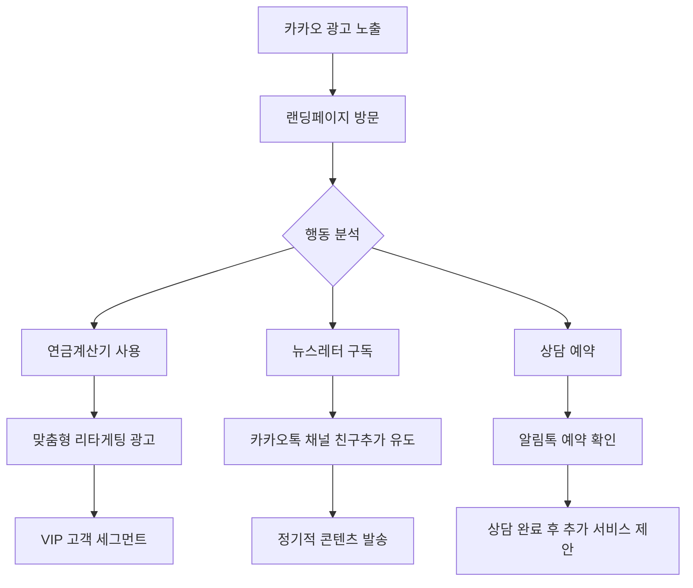

# 카카오비즈니스 솔루션 통합 계획서

## 📋 개요

FamilyOffice S 플랫폼에 카카오비즈니스 광고 및 홍보 기능을 통합하여 성공한 CEO 및 기업가들에게 더 효과적으로 도달하고, 마케팅 ROI를 극대화하는 전략을 수립합니다.

## 🎯 핵심 목표

### 1. 타겟 고객 정밀 도달
- **주요 타겟**: 중소중견기업 CEO, 성공한 기업가, 자산 10억 이상 고액자산가
- **카카오 생태계**: 카카오톡, 카카오스토리, 다음 검색 등을 통한 전방위 접근
- **개인화 마케팅**: 행동 패턴과 관심사 기반 맞춤형 광고

### 2. 마케팅 자동화 구현
- **리드 생성 자동화**: 상담 예약, 뉴스레터 구독, 세미나 참가 신청
- **고객 여정 최적화**: 인지 → 관심 → 고려 → 결정 단계별 맞춤 콘텐츠
- **ROI 추적**: 실시간 성과 모니터링 및 최적화

## 🏗️ 통합 아키텍처 설계

### 기술 스택
```
Frontend (Next.js 15)
├── Kakao Pixel Integration
├── Kakao Login SDK
├── Kakao Share API
└── Analytics Dashboard

Backend Services
├── Kakao Business API Client
├── Campaign Management Service
├── Lead Tracking System
└── ROI Analytics Engine

Database (Supabase)
├── Campaign Data
├── Customer Journey Tracking
├── Conversion Analytics
└── Performance Metrics
```

## 🔧 핵심 통합 컴포넌트

### 1. 카카오 광고 플랫폼 연동

#### 1.1 카카오모먼트 (Kakao Moment) 광고
```typescript
// 광고 캠페인 관리 서비스
interface KakaoMomentCampaign {
  campaignId: string;
  targetAudience: {
    demographics: CEOTargeting;
    interests: WealthManagementInterests;
    behaviors: BusinessOwnerBehaviors;
  };
  adFormats: {
    display: DisplayAdConfig;
    video: VideoAdConfig;
    native: NativeAdConfig;
  };
  budget: CampaignBudget;
  performance: AdPerformanceMetrics;
}
```

#### 1.2 키워드 광고 (다음 검색)
```typescript
// 검색 광고 최적화
interface SearchAdConfiguration {
  keywords: string[]; // "패밀리오피스", "자산관리", "가업승계" 등
  bidStrategy: "CPC" | "CPM" | "CPA";
  landingPages: {
    "/": "메인 랜딩";
    "/pension-calculator": "연금계산기 직접 유입";
    "/contact": "상담예약 페이지";
  };
  qualityScore: number;
}
```

### 2. 카카오톡 채널 & 메시징 서비스

#### 2.1 카카오톡 비즈니스 채널
```typescript
interface KakaoBusinessChannel {
  channelId: string; // 기존: _gsxkxdG
  channelName: "FamilyOffice S";
  services: {
    chatbot: AutomatedConsultation;
    broadcasting: NewsletterIntegration;
    customerService: HumanAgentHandoff;
  };
  analytics: ChannelPerformanceMetrics;
}
```

#### 2.2 카카오 알림톡 & 친구톡
```typescript
interface KakaoMessagingService {
  alimtalk: {
    templates: ConsultationReminders | SeminarInvitations;
    approval: TemplateApprovalStatus;
    delivery: MessageDeliveryTracking;
  };
  friendtalk: {
    personalizedOffers: CustomizedInvestmentTips;
    relationshipMarketing: VIPCustomerEngagement;
  };
}
```

### 3. 트래킹 & 분석 시스템

#### 3.1 카카오 픽셀 구현
```typescript
// components/kakao/kakao-pixel.tsx
'use client';

interface KakaoPixelEvent {
  event_name: 'PageView' | 'CompleteRegistration' | 'Purchase' | 'Contact';
  parameters: {
    content_category?: 'consultation' | 'seminar' | 'newsletter';
    content_ids?: string[];
    value?: number;
    currency?: 'KRW';
  };
}

export function KakaoPixel({ pixelId }: { pixelId: string }) {
  useEffect(() => {
    // Kakao Pixel 초기화
    window.kakaoPixel = window.kakaoPixel || [];
    window.kakaoPixel.push(['init', pixelId]);
    window.kakaoPixel.push(['track', 'PageView']);
  }, [pixelId]);
}
```

#### 3.2 고객 여정 추적
```typescript
interface CustomerJourneyTracking {
  sessionId: string;
  userId?: string;
  touchpoints: Array<{
    timestamp: Date;
    source: 'kakao_ad' | 'kakao_search' | 'organic' | 'direct';
    kclid?: string; // 카카오 클릭 ID
    action: 'page_view' | 'form_submission' | 'download' | 'consultation_booking';
    page: string;
    value?: number;
  }>;
  attribution: {
    firstTouch: TouchpointData;
    lastTouch: TouchpointData;
    conversion: ConversionData;
  };
}
```

## 📊 마케팅 자동화 워크플로우

### 1. 리드 생성 & 너처링

#### 1.1 자동화된 캠페인 시퀀스


#### 1.2 세분화된 고객 여정
```typescript
interface CustomerSegments {
  newProspect: {
    kakaoAd: DisplayRetargeting;
    messaging: WelcomeSequence;
    content: EducationalMaterials;
  };
  engagedVisitor: {
    kakaoAd: ConsiderationRetargeting;
    messaging: ValueDrivenContent;
    content: CaseStudies;
  };
  qualifiedLead: {
    kakaoAd: ConversionOptimized;
    messaging: PersonalizedOffers;
    content: ExclusiveInvitations;
  };
  existingClient: {
    kakaoAd: UpsellCampaigns;
    messaging: RelationshipMaintenance;
    content: PremiumInsights;
  };
}
```

### 2. 성과 측정 & 최적화

#### 2.1 핵심 성과 지표 (KPI)
```typescript
interface KakaoMarketingKPIs {
  acquisition: {
    impressions: number;
    clicks: number;
    ctr: number;
    cpc: number;
    qualityScore: number;
  };
  engagement: {
    pageViews: number;
    sessionDuration: number;
    bounceRate: number;
    pagesPerSession: number;
  };
  conversion: {
    leads: number;
    consultations: number;
    signups: number;
    conversionRate: number;
    costPerLead: number;
  };
  retention: {
    returnVisitors: number;
    channelSubscribers: number;
    messageOpenRate: number;
    engagementScore: number;
  };
}
```

#### 2.2 실시간 대시보드
```typescript
// components/admin/kakao-marketing-dashboard.tsx
interface MarketingDashboard {
  campaigns: LiveCampaignPerformance[];
  audiences: AudienceInsights[];
  conversions: ConversionFunnel;
  roi: ROICalculation;
  recommendations: OptimizationSuggestions[];
}
```

## 💰 예산 배분 및 ROI 전략

### 1. 광고 예산 최적화
```typescript
interface BudgetAllocation {
  monthly: {
    kakaoMoment: 3000000; // 300만원 - 디스플레이/비디오 광고
    searchAds: 2000000;   // 200만원 - 키워드 광고
    retargeting: 1000000; // 100만원 - 리타게팅
    messaging: 500000;    // 50만원 - 알림톡/친구톡
  };
  targeting: {
    newAcquisition: 60%;  // 신규 고객 획득
    retargeting: 40%;     // 기존 방문자 전환
  };
  optimization: {
    testBudget: 10%;      // A/B 테스트용
    scalingBudget: 20%;   // 성과 좋은 캠페인 확장
  };
}
```

### 2. ROI 목표 설정
```typescript
interface ROITargets {
  costPerLead: 100000;      // 리드당 10만원
  leadToCustomer: 0.20;     // 리드-고객 전환율 20%
  averageCustomerValue: 5000000; // 고객 평균 가치 500만원
  targetROAS: 10;           // 광고 수익률 1000% (10:1)
  paybackPeriod: 6;         // 투자 회수 기간 6개월
}
```

## 🔒 컴플라이언스 & 정책 준수

### 1. 금융업 광고 규제 준수
```typescript
interface ComplianceRequirements {
  financialAdvertising: {
    disclaimers: FinancialRiskWarnings;
    approvals: RegulatoryApprovalTracking;
    contentReview: AdvertisingContentAudit;
  };
  dataPrivacy: {
    consent: UserConsentManagement;
    tracking: TransparentTrackingPolicy;
    retention: DataRetentionPolicy;
  };
  kakaoPolicy: {
    contentGuidelines: KakaoContentPolicy;
    industryRestrictions: FinancialServiceLimitations;
    adReview: AutomatedAdReviewProcess;
  };
}
```

## 🚀 구현 로드맵

### Phase 1: 기초 설정 (1-2주)
- [ ] 카카오비즈니스 계정 통합 설정
- [ ] 카카오 픽셀 및 기본 추적 구현
- [ ] 카카오톡 채널 최적화
- [ ] 기본 리타게팅 캠페인 설정

### Phase 2: 고급 기능 (3-4주)
- [ ] 자동화된 캠페인 관리 시스템
- [ ] 세분화된 고객 여정 추적
- [ ] 알림톡/친구톡 템플릿 개발
- [ ] 실시간 성과 대시보드 구축

### Phase 3: 최적화 & 확장 (5-6주)
- [ ] AI 기반 광고 최적화
- [ ] 고급 세그멘테이션 구현
- [ ] 크로스 채널 마케팅 자동화
- [ ] 종합 ROI 분석 시스템

### Phase 4: 고도화 (7-8주)
- [ ] 예측 분석 및 머신러닝 모델
- [ ] 개인화 엔진 고도화
- [ ] 통합 CRM 시스템 연동
- [ ] 장기 고객 가치 최적화

## 📈 예상 성과

### 1. 정량적 성과 목표
- **신규 리드 증가**: 월 200% 증가 (현재 대비)
- **상담 예약률**: 15% 개선
- **고객 획득 비용**: 30% 절감
- **마케팅 ROI**: 10:1 달성
- **브랜드 인지도**: 타겟층 내 50% 증가

### 2. 정성적 성과 목표
- **타겟 정확도**: CEO/기업가층 정밀 타게팅
- **고객 경험**: 개인화된 마케팅 경험 제공
- **브랜드 포지셔닝**: 프리미엄 패밀리오피스 브랜드 강화
- **시장 점유율**: 국내 패밀리오피스 시장 선도 기업 위상 확립

## 🔧 기술적 구현 세부사항

### API 통합 구조
```typescript
// lib/kakao/business-api.ts
export class KakaoBusinessAPI {
  private apiKey: string;
  private baseURL: string;
  
  async createCampaign(config: CampaignConfig): Promise<Campaign> {}
  async trackConversion(event: ConversionEvent): Promise<void> {}
  async getAnalytics(params: AnalyticsParams): Promise<Analytics> {}
  async manageAudience(audience: AudienceConfig): Promise<Audience> {}
}
```

### 환경 변수 설정
```bash
# .env.local 추가 항목
KAKAO_BUSINESS_API_KEY=your_api_key
KAKAO_PIXEL_ID=your_pixel_id
KAKAO_CHANNEL_ID=_gsxkxdG
KAKAO_APP_KEY=your_app_key
KAKAO_REST_API_KEY=your_rest_api_key
```

이 통합 계획을 통해 FamilyOffice S는 카카오 생태계를 활용한 최적화된 마케팅 시스템을 구축하고, ROI를 극대화하면서 타겟 고객층에게 효과적으로 도달할 수 있습니다.