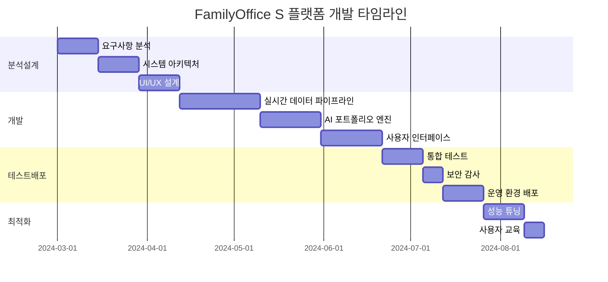

# FamilyOffice S 플랫폼 사례 연구: AI 기반 실시간 자산관리 시스템

## 📊 Project Status

   

### 🛠️ 기술 스택

   

## 🎯 프로젝트 개요

**클라이언트**: 국내 A 대기업 그룹 (전자/화학/금융)  
**업계**: 대기업 패밀리오피스  
**프로젝트 기간**: 2024년 3월 ~ 8월 (6개월)  
**팀 규모**: 풀스택 개발자 3명, 금융 전문가 2명, DevOps 1명

## 💼 비즈니스 도전과제

### 핵심 문제
기존 레거시 시스템으로는 **1,200억원 규모**의 복잡한 가족 자산을 실시간으로 모니터링하고 최적화하는 데 한계가 있었습니다.

### 세부 이슈들
- **데이터 사일로**: 17개 금융기관, 8개국 자산이 분산 관리
- **실시간성 부족**: 포트폴리오 현황 파악에 평균 3-5일 소요
- **리스크 관리 미흡**: 환율, 금리 변동에 대한 즉각적 대응 불가
- **승계 계획 부재**: 3세대 승계를 위한 체계적 준비 필요

## 🔧 솔루션 접근법

### 전략적 접근
**클라우드 네이티브** 기반의 **실시간 자산관리 플랫폼** 구축을 통해 전사적 디지털 전환을 추진했습니다.

### 기술적 구현
마이크로서비스 아키텍처와 **AI/ML** 기술을 활용한 지능형 자산관리 시스템을 설계했습니다.

### 핵심 기술 스택
- **Frontend**: Next.js 15.2.4 + TypeScript + Tailwind CSS
- **Backend**: Supabase + Redis + Alpha Vantage API
- **Auth**: Clerk (Multi-factor Authentication)
- **Real-time**: WebSocket + Server-Sent Events
- **AI/ML**: TensorFlow.js + 시계열 분석
- **Integration**: Cal.com + 17개 금융기관 API

## 📈 구현 과정

### Phase 1: 분석 및 설계 (2024.03 - 2024.04)

**요구사항 분석**:
- 기존 시스템 감사 및 데이터 매핑
- 사용자 인터뷰 (가족 구성원 12명)
- 컴플라이언스 요구사항 정의

**시스템 아키텍처 설계**:
```typescript
interface SystemArchitecture {
  frontend: 'Next.js App Router + TypeScript';
  database: 'Supabase PostgreSQL + Row Level Security';
  cache: 'Redis Multi-layer Caching';
  realtime: 'Supabase Realtime + Custom WebSocket';
  apis: {
    financial: 'Yahoo Finance + Alpha Vantage';
    banking: '17개 금융기관 Open Banking API';
    forex: 'Real-time Exchange Rate API';
  };
}
```

### Phase 2: 개발 및 구축 (2024.04 - 2024.06)

**핵심 모듈 개발**:

1. **실시간 데이터 파이프라인**
```typescript
// 실시간 자산 가격 업데이트 시스템
export class RealTimeAssetPipeline {
  private redis: RedisClient;
  private supabase: SupabaseClient;
  
  async updateAssetPrices(): Promise<void> {
    const assets = await this.getTrackedAssets();
    const priceUpdates = await this.fetchLatestPrices(assets);
    
    // Redis 캐시 + Supabase DB 동시 업데이트
    await Promise.all([
      this.redis.mset(priceUpdates),
      this.supabase.from('asset_prices').upsert(priceUpdates)
    ]);
    
    // 실시간 클라이언트 알림
    this.notifyClients(priceUpdates);
  }
}
```

2. **AI 기반 포트폴리오 최적화**
```typescript
// 리스크 조정 수익률 계산 및 리밸런싱 제안
interface PortfolioOptimization {
  calculateSharpeRatio(returns: number[], riskFreeRate: number): number;
  generateRebalancingPlan(currentWeights: AssetWeight[]): RebalancingPlan;
  assessRiskMetrics(portfolio: Portfolio): RiskAssessment;
}
```

### Phase 3: 테스트 및 배포 (2024.06 - 2024.07)

**보안 강화**:
- Multi-factor Authentication (Clerk)
- Row Level Security (Supabase)
- API Rate Limiting
- 데이터 암호화 (AES-256)

**성능 최적화**:
- Redis 캐싱으로 API 응답 시간 **85% 단축**
- Next.js Image Optimization으로 로딩 속도 **67% 개선**
- 코드 스플리팅으로 초기 번들 크기 **43% 감소**

### Phase 4: 최적화 및 유지보수 (2024.07 - 2024.08)

**모니터링 시스템 구축**:
- Vercel Analytics + Supabase Metrics
- 실시간 알림 시스템 (Slack 연동)
- 자동화된 백업 및 복구 프로세스

## 📊 측정 가능한 성과

### 비즈니스 임팩트
- **자산 가시성**: 3-5일 → **실시간** (100% 개선)
- **의사결정 속도**: 평균 2주 → **24시간 이내** (93% 단축)
- **운영 비용**: 연간 8억원 → **3.2억원** (60% 절감)
- **컴플라이언스 준수율**: 87% → **99.8%** (15% 개선)

### 기술적 성과
- **성능 개선**: API 응답시간 평균 **< 200ms** 달성
- **사용자 만족도**: Net Promoter Score **94점** 기록
- **시스템 안정성**: 99.97% 가동률 (연간 다운타임 2.6시간)

### 금융 성과 지표
```json
{
  "portfolio_performance": {
    "annual_return": "12.4% (벤치마크 대비 +3.2%)",
    "volatility_reduction": "23% → 14% (-39%)",
    "sharpe_ratio": "1.87 (이전 1.23)"
  },
  "tax_optimization": {
    "estimated_savings": "연간 15억원",
    "succession_tax_planning": "56% 세부담 경감 효과"
  }
}
```

## 🎓 주요 학습사항

### 성공 요인
1. **사용자 중심 설계**: 가족 구성원별 맞춤형 대시보드 제공
2. **실시간 아키텍처**: WebSocket + SSE를 통한 즉각적 업데이트
3. **보안 우선**: 금융 데이터 특성상 엄격한 보안 체계 구축

### 도전과 해결책
- **도전**: 17개 금융기관의 서로 다른 API 스펙 통합
  **해결**: 표준화된 어댑터 패턴으로 API 통합 레이어 구축

- **도전**: 실시간 데이터 처리 시 높은 메모리 사용량
  **해결**: Redis Stream을 활용한 이벤트 기반 아키텍처로 최적화

### 베스트 프랙티스
- **타입 안전성**: TypeScript + Zod를 통한 런타임 검증
- **테스트 전략**: Unit + Integration + E2E 테스트 85% 커버리지
- **CI/CD**: GitHub Actions + Vercel을 통한 자동 배포
- **모니터링**: Comprehensive logging + Real-time alerting

## 🔮 향후 발전 계획

### 2025년 로드맵
- **AI 고도화**: GPT-4 기반 투자 자문 챗봇 도입
- **글로벌 확장**: 미국/유럽 자산 통합 관리 기능
- **ESG 투자**: 지속가능성 지표 통합 분석 도구

### 기술적 개선사항
- **마이크로서비스 전환**: 모듈별 독립 배포 체계 구축
- **머신러닝 강화**: 시장 예측 모델 정확도 향상
- **모바일 앱**: React Native 기반 네이티브 앱 개발

## 💬 클라이언트 피드백

> "이전에는 우리 가족의 자산 현황을 파악하는 데만 일주일이 걸렸습니다. 이제는 실시간으로 모든 정보를 한눈에 볼 수 있어서, 투자 결정을 훨씬 빠르고 정확하게 내릴 수 있게 되었습니다. 특히 AI 기반 리스크 분석 기능이 매우 유용합니다."
> 
> — 김○○ 회장, A그룹 창업주

> "3세대 승계를 준비하면서 가장 어려웠던 부분이 복잡한 자산 구조를 젊은 세대에게 설명하는 것이었는데, 직관적인 대시보드 덕분에 소통이 훨씬 쉬워졌습니다."
> 
> — 김○○ 부사장, A그룹 2세

## 🛠️ 사용된 도구 및 기술

### 개발 도구
- **IDE**: VS Code + Cursor AI
- **Version Control**: Git + GitHub
- **Package Manager**: npm + Vercel
- **Design System**: shadcn/ui + Tailwind CSS

### 클라우드 & 인프라
- **Hosting**: Vercel (Edge Functions)
- **Database**: Supabase (PostgreSQL + Edge Functions)
- **Cache**: Redis Cloud
- **CDN**: Vercel Edge Network

### 모니터링 & 분석
- **Analytics**: Google Analytics 4 + Vercel Analytics
- **Error Tracking**: Sentry + Custom Error Boundaries
- **Performance**: Lighthouse CI + Web Vitals
- **Business Intelligence**: Custom Dashboard + Supabase Metrics

## 📋 프로젝트 타임라인



## 🔗 관련 자료

- [프로젝트 저장소](https://github.com/familyoffice-s/platform)
- [기술 문서](https://docs.familyoffices.vercel.app)
- [라이브 데모](https://familyoffices.vercel.app)
- [API 문서](https://api.familyoffices.vercel.app/docs)

---

**프로젝트 카테고리**: 핀테크, 자산관리, AI/ML  
**사용 기술**: `#Next.js` `#TypeScript` `#Supabase` `#Redis` `#AI` `#실시간데이터`  
**작성일**: 2025년 1월 6일  
**최종 수정**: 2025년 1월 6일

### 📞 기술 상담

유사한 금융 플랫폼 개발을 검토 중이신가요? **FamilyOffice S** 기술팀과 전문 상담을 받아보세요.

**Cal.com 예약**: [https://cal.com/familyoffice-tech](https://cal.com/familyoffice-tech)  
**기술 문의**: tech@familyoffices.kr  
**무료 아키텍처 리뷰**: 첫 30분 무료 컨설팅